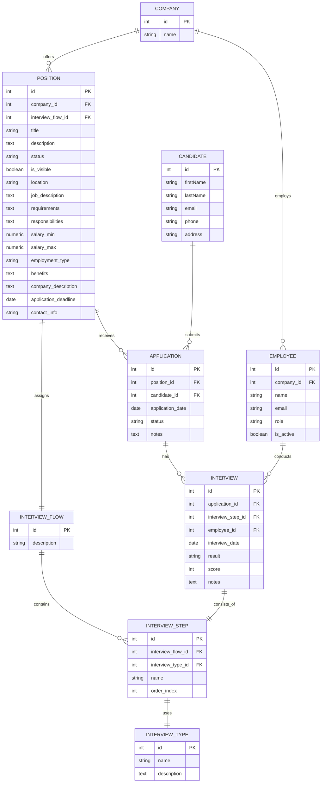

# Metaprompt

# Prompt: ER to Enhanced Prisma Schema + Migration

## Context

You are working on the **LTI Talent Tracking System** — a Node.js/TypeScript backend with Express, Prisma 5.x ORM, and PostgreSQL. The full project context is in `CLAUDE.md` at the project root. Read it before starting.

You have two active skills for this task:
- `prisma-db` — Prisma patterns, indexes, migration authoring, query optimization
- `db-schema-design` — normalization analysis, PostgreSQL-native types, integrity constraints, decomposition

Apply both skills throughout this task.

---

## Input

The target database model is defined in the ER diagram at `er.mmd` in the project root.



---

## Task Sequence

Execute these steps in order. Do not skip steps or combine them without completing each one first.

### Step 1 — Read and understand the current state

Read all of the following before writing a single line of output:

1. `CLAUDE.md` — project conventions and stack
2. `backend/prisma/schema.prisma` — current Prisma schema (the source of truth)
3. `backend/prisma/migrations/` — existing migration history (understand what is already applied)
4. `backend/src/domain/models/` — all domain model files
5. `backend/src/application/services/candidateService.ts` — understand existing data access patterns
6. `backend/src/application/validator.ts` — understand existing validation rules
7. `er.mmd` — the target ER diagram

Only after reading all of the above, proceed to Step 2.

---

### Step 2 — Generate the baseline SQL script

Translate the ER diagram faithfully into a PostgreSQL SQL script. This is a reference artifact — it represents the ER diagram as-is, without enhancements yet.

Rules for this SQL script:
- Use `SERIAL` or `INTEGER GENERATED ALWAYS AS IDENTITY` for PKs
- Use `TEXT` for all `text` fields, `VARCHAR(n)` for `string` fields (choose `n` based on domain knowledge)
- Use `NUMERIC(10,2)` for `salary_min` / `salary_max`
- Use `DATE` for date fields, `BOOLEAN` for boolean fields
- Add all FK constraints with explicit `REFERENCES` clauses
- Include `NOT NULL` where the ER diagram implies a required field (all non-optional fields)
- Name all constraints explicitly: `fk_<table>_<column>`, `uq_<table>_<column>`, `pk_<table>`
- Table names in `snake_case`, matching the ER diagram

Save this script as `backend/prisma/sql/er-baseline.sql`.

---

### Step 3 — Cross-analysis: ER + codebase + best practices

Before writing the enhanced schema, perform a full analysis across three dimensions. Document your findings — they will drive every decision in Step 4.

#### 3a. Normalization audit (apply `db-schema-design` skill)

For each entity in the ER diagram, evaluate 1NF, 2NF, and 3NF:

- `POSITION.contact_info` — is this atomic? Could it be decomposed?
- `POSITION.company_description` — is this a transitive dependency through `company_id`? If `COMPANY` already has a `name`, does duplicating description here violate 3NF?
- `CANDIDATE.address` — is a single address string sufficient, or should it be decomposed into structured fields (street, city, country, postal_code)?
- `EMPLOYEE.role` — is this a free-text field or a fixed-value set? If fixed, should it be a PostgreSQL `enum`?
- `POSITION.status`, `APPLICATION.status`, `INTERVIEW.result`, `POSITION.employment_type` — same question: fixed set → `enum`?
- `INTERVIEW_STEP.order_index` — is uniqueness enforced within a flow? A composite unique constraint may be needed.

#### 3b. Type and constraint audit (apply `db-schema-design` skill)

For each field, evaluate the PostgreSQL-native type:
- All `DateTime` / timestamp fields: should use `TIMESTAMPTZ` (timezone-aware), not plain `TIMESTAMP`
- `salary_min` / `salary_max`: `NUMERIC(10,2)` — verify precision is sufficient; add a `CHECK (salary_min <= salary_max)` constraint
- `INTERVIEW.score`: what is the valid range? Add `CHECK (score >= 0 AND score <= 100)` if 0–100 scale
- `APPLICATION.application_date`, `INTERVIEW.interview_date`: `DATE` or `TIMESTAMPTZ`? Prefer `TIMESTAMPTZ` for interviews (time matters); `DATE` may be sufficient for applications
- `POSITION.is_visible`, `EMPLOYEE.is_active`: `BOOLEAN NOT NULL DEFAULT false` — never nullable booleans

#### 3c. Index strategy (apply `prisma-db` skill)

Identify every column that will appear in a WHERE clause, JOIN, or ORDER BY in a realistic ATS workload:
- All FK columns (mandatory `@@index`)
- `Candidate.email` (already `@unique` — also serves as index)
- `Employee.email` (should be `@unique`)
- `Position.status` (filter: "show only active positions")
- `Application.status` (filter: "show applications by status")
- `InterviewStep.order_index` within a flow (ORDER BY)
- `Position.application_deadline` (filter: "positions closing soon")
- Composite: `(candidateId, positionId)` on `Application` — a candidate should not apply twice to the same position → also a `@@unique` constraint

#### 3d. Cascade rules

For each FK, decide the `onDelete` and `onUpdate` behaviour:
- `Employee → Company`: `onDelete: Restrict` (don't delete a company with employees)
- `Position → Company`: `onDelete: Restrict`
- `Position → InterviewFlow`: `onDelete: Restrict`
- `Application → Position`: `onDelete: Restrict` (applications must not vanish silently)
- `Application → Candidate`: `onDelete: Restrict`
- `Interview → Application`: `onDelete: Cascade` (deleting an application removes its interviews)
- `Interview → InterviewStep`: `onDelete: Restrict`
- `Interview → Employee`: `onDelete: Restrict`
- `InterviewStep → InterviewFlow`: `onDelete: Cascade`
- `InterviewStep → InterviewType`: `onDelete: Restrict`

Override any of the above if the analysis reveals a better rule — document the reason.

#### 3e. Existing model compatibility

The current `schema.prisma` has: `Candidate`, `Education`, `WorkExperience`, `Resume`.

- `Candidate` exists in both the current schema and the ER diagram — merge carefully, preserving existing fields (`educations`, `workExperiences`, `resumes` relations)
- `Education`, `WorkExperience`, `Resume` are NOT in the ER diagram — retain them; do not drop them
- All existing FK columns need `@@index` added if missing

---

### Step 4 — Write the enhanced `schema.prisma`

Using all findings from Step 3, rewrite `backend/prisma/schema.prisma` with the full enhanced model.

Requirements:
- Retain all existing models (`Candidate`, `Education`, `WorkExperience`, `Resume`) and their relations
- Add all new models from the ER diagram with enhancements applied
- Use Prisma `enum` for all fixed-value fields identified in Step 3a
- Use `@db.Timestamptz` for all timestamp fields
- Use `@db.Numeric(10,2)` for salary fields
- Add `@@index` for every FK column and every query-pattern column identified in Step 3c
- Add `@@unique` where composite uniqueness is required (e.g., one application per candidate per position)
- Add `onDelete` / `onUpdate` to every `@relation` as decided in Step 3d
- Add `@default(false)` to all boolean fields
- Use `String` (PostgreSQL `text`) for all open-ended text fields; use `@db.VarChar(n)` only for fields with a known maximum length
- Add `createdAt DateTime @default(now()) @db.Timestamptz` and `updatedAt DateTime @updatedAt @db.Timestamptz` to every model that doesn't already have them
- Follow Prisma naming conventions: model names in `PascalCase`, field names in `camelCase`, table/column names mapped to `snake_case` via `@@map` / `@map` if needed for PostgreSQL conventions

---

### Step 5 — Write the migration

Create a new Prisma migration file in `backend/prisma/migrations/` named:

```
<timestamp>_enhanced_ats_schema
```

The migration must:
- Be a valid SQL file that applies on top of the existing migration history (not a reset)
- Include all `CREATE TABLE` statements for new models
- Include all `ALTER TABLE` statements for changes to existing models (e.g., adding indexes to `Education`, `WorkExperience`, `Resume`)
- Include all `CREATE INDEX` statements — use `CREATE INDEX CONCURRENTLY` where supported for large tables
- Include all `ALTER TABLE ... ADD CONSTRAINT` statements for CHECK constraints
- Include all `CREATE TYPE` statements for PostgreSQL enums (before the tables that use them)
- Include data migration SQL for any field that is renamed or type-changed (e.g., if `address` is decomposed)
- Never drop existing columns without a data migration step first

Also run (document the command, do not execute it):
```bash
cd backend && npx prisma migrate dev --name enhanced_ats_schema
```

---

### Step 6 — Deliver the decision summary

After all files are written, produce a structured summary with the following sections:

#### Normalization decisions
For each entity: state the normal form status and any decomposition applied. If no change was needed, say so explicitly.

#### Type changes
Table of every field where the type was changed from the ER diagram's suggestion, with the reason.

#### Enums created
List every `enum` created, its values, and why it was chosen over a free-text field.

#### Indexes created
Table of every index: model, column(s), type (single/composite/unique), and the query pattern it serves.

#### Cascade rules applied
Table of every FK: `onDelete` / `onUpdate` rule chosen and the reason.

#### Constraints added
List every `CHECK` constraint added beyond what Prisma expresses natively.

#### Existing model changes
Describe every change made to the pre-existing models (`Candidate`, `Education`, `WorkExperience`, `Resume`).

#### Breaking changes
List any changes that affect existing API behaviour (field renames, type changes, removed columns). For each one: what breaks, and what the migration step does to preserve data.

---

## Hard rules

- Do not modify `backend/src/` application code — schema and migration only
- Do not drop any existing column without a data migration step in the same migration file
- Do not use `prisma db push` — always use `prisma migrate dev`
- Do not edit any previously applied migration file
- Every decision must appear in the Step 6 summary — no silent choices
